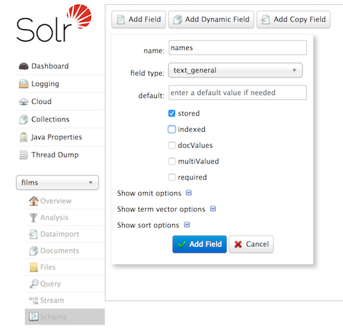
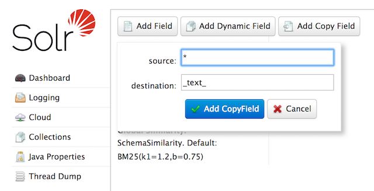

- Install the latest Java Runtime
- download latest `solr.tgz` file from `solr` official website
- untar, install & start
```
$ tar -xzf solr.tgz
$ cd solr
$ bin/solr start
$ bin/solr status
$ bin/solr stop
```

- Point browser to `http://localhost:8083` for admin dashboard
- create a new collection
```
$ bin/solr create -c <collection-name>
```
- delete a collection
```
$ bin/solr delete -c <collection-name>
```

#### Create Schemaless Index
- set type for `name` field so that it's not wrognly identified any other type other than `text`, as some has number as their title
- schema type should be set before storing any documents
- to create field
```
$ curl -X POST -H 'Content-type:application/json' --data-binary '{"add-field": {"name":"name", "type":"text_general", "multiValued":false, "stored":true}}' http://localhost:8983/solr/<collection-name>/schema
```
- or using admin dashboard



- `catchall` copy field
	- searched when no `field` is defined in `q`
	- e.g `q=search-string`
	- `catchall field` will combine all text fields and index it into a field named _text_.
	- this is expensive as it copy's every field
	- it's like indexing everything twice
	- not good for production
- create using `http`
```
curl -X POST -H 'Content-type:application/json' --data-binary '{"add-copy-field" : {"source":"*","dest":"_text_"}}' http://localhost:8983/solr/<collection-name>/schema
```
- using admin



#### Creating custom collection
- create a collection called `items`
```
$ bin/solr create -c items -d <config-name>
```

- Store items
```
http://localhost:8983/solr/<collection_name>/update?commitWithin=1000
{
	[ 
		{ "name": "John", "age": 30, "cars": "BMW" }, 
		{ "name": "Harry", "age": 30, "cars": "BMW" }, 
		{ "name": "Pinku", "age": 30, "cars": "BMW" } 
	]
}
```

#### Deleting
```
# delete a specific document:

$ bin/post -c localDocs -d "<delete><id>SP2514N</id></delete>"

# delete all documents, you can use "delete-by-query" command like:

bin/post -c localDocs -d "<delete><query>*:*</query></delete>"

# delete the whole collection
$ bin/solr delete -c items
```

#### Custom Configuration
- Copy default config to desired config folder
```
$ cd <solr-dir>/server/solr/configsets
$ cp _default to <new-config-folder-name>
```
- make necessary changes
- use example config from `docs/configs/solr` 

#### JSON Api
- Get an item by `id`
```
curl http://localhost:8983/solr/<col>/get?id=book1
```

#### Tutorials
- http://yonik.com/solr-tutorial/
- http://www.solrtutorial.com/solr-in-5-minutes.html
- http://lucene.apache.org/solr/guide/7_2/solr-tutorial.html
- facets
	- https://lucidworks.com/2009/09/02/faceted-search-with-solr/

